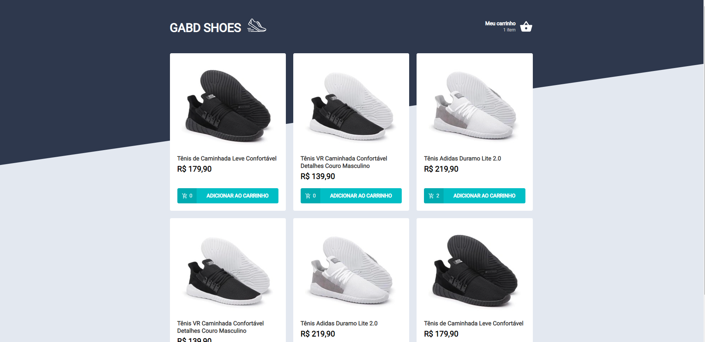
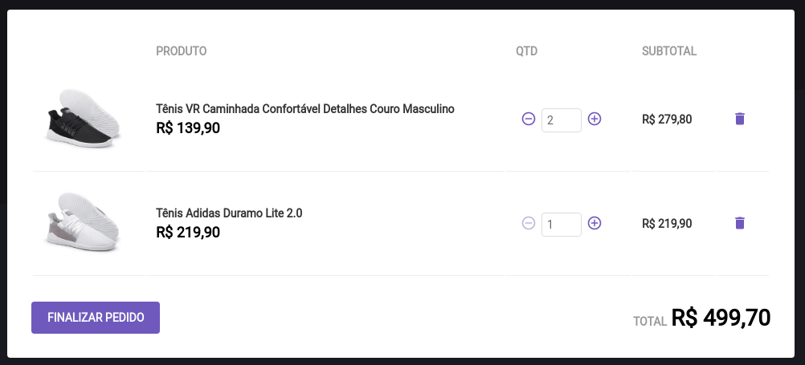

<h2 id="the_challenge"  align="center">⚡ The Challenge  </h2>

   
   

    
  

    
 In this challenge the main objective is to create a shopping cart hook. The application has two pages, a component and a hook to implement the features requested in this challenge: 

  

- <b>Add a new product to cart</b>
- <b>Remove a product from cart</b>
- <b>Change the quantity of a product in the cart</b>
- <b>Calculating sub-total and total cart prices</b>
- <b>Inventory Validation</b>
- <b>Error message display</b>

 
 

<h2 id = "author" align="center"></h2>

<table align="center">
  <tr>
      <td>
      <a href="https://github.com/gabriel-durr">
         
      </a>
      </td>
  </tr>
</table>

<b><em>Made with 💜&ensp;by Gabriel Dürr</em></b>

